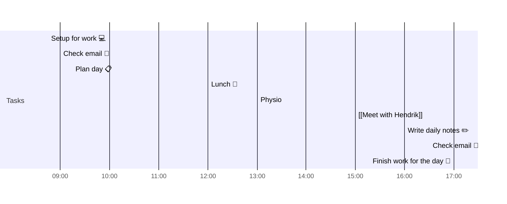

# 📆 2021-05-04

Before planning a day, reflect on the [[PhD Timeline]]. Does what you [[want to do]] match what you [[need to do]]?

## PhD Timeline

![[PhD Timeline]]

## Day Planner


- [x] 08:45 Setup for work 💻
- [x] 09:00 Check email 📧
- [ ] 09:15 Plan day 📋
- [ ] 12:00 Lunch 🍙
- [ ] 13:00 Physio
- [ ] 15:00 [[Meet with Hendrik]]
- [ ] 16:00 Write daily notes ✏️
- [ ] 16:30 Check email 📧
- [ ] 17:00 Finish work for the day 🎉

## Tasks

### Overdue

```dataview
table due, project, tags
from "tasks"
where status="priority" and status!="done" and due<date(2021-05-04)
sort due
```


### Due

```dataview
table due, time, project, tags
from "tasks"
where status!="done" and due=date(2021-05-04)
sort due
```

### Done

```dataview
table due, project, tags
from "tasks"
where status="done" and due=date(2021-05-04)
sort due
```

### Upcoming

```dataview
table due, project, tags
from "tasks"
where status!="done" and status!="idea" and due>date(2021-05-04)
sort due
```

---

tags: [[Journal]]  
prev: [[2021-05-04]]  
next: [[2021-05-04]]  