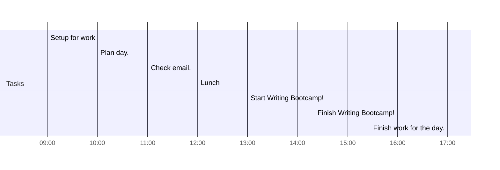

# 📆 2021-03-22

## Day Planner

### Morning

- [x] 09:00 Setup for work
- [x] 10:00 Plan day.
- [x] 11:00 Check email.
- [x] 12:00 Lunch

### Afternoon

- [x] 13:00 Start Writing Bootcamp!
- [x] 16:00 Finish Writing Bootcamp!
- [x] 17:00 Finish work for the day.

## Notes

I created a template for [[People]] and added the following:

- [[Hendrik Poinar]]
- [[Julia Gamble]]
- [[Jesper Boldsen]]
- [[Marie-Helene B Hardy]]

I created a template for [[Literature]] and added the following:

- [[andradesvaltuena2017StoneAgePlague]]
- [[eroshenko2021EvolutionCirculationYersinia]]
- [[rasmussen2015EarlyDivergentStrains]]
- [[sagulenko2018TreeTimeMaximumlikelihoodPhylodynamic]]
- 

I discovered you can embed the content of a markdown file within another like:

