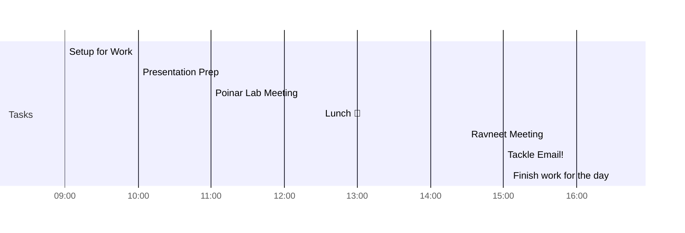

# 📆 2021-03-23

## Day Planner

### Morning

- [x] 09:00 Setup for Work
- [x] 10:00 Presentation Prep
- [x] 11:00 Poinar Lab Meeting

### Afternoon
- [x] 12:30 Lunch 🍙
- [x] 14:30 Ravneet Meeting
- [x] 15:00 Tackle Email!
- [x] 16:30 Finish work for the day

