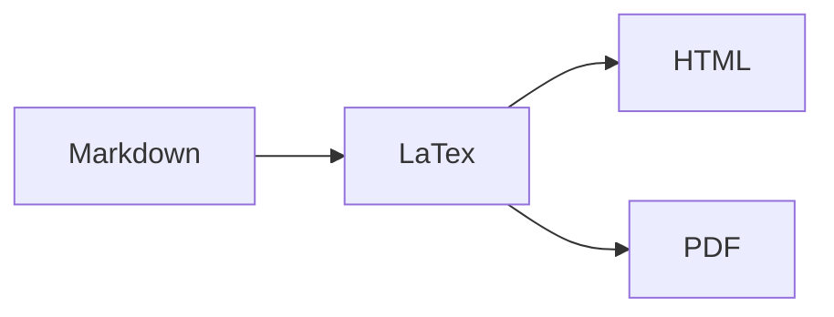

# 2021-03-26 Scratch

## Email

I started out today by answering some email. I wrote notes on [[MEGAN]] for [[@Marie-Helene B Hardy|Marie-Helene]] and [[@Jessica Hider]]

I'm intrigued with the possibility of rendering a [[Markdown]] in a [[A4]] paper format with [[page breaks]]. I installed a couple extensions for [[Visual Studio Code]]:
- [[Mermaid]] [[Markdown]] [[Syntax Highlighting]]
- [[Markdown Preview]] [[Mermaid]] Support
- [[Markdown]] [[PDF]]
- [[Markdown Preview]] [[github]] Styling
- [[Markdown Table]] Prettifier

None of these specifically helped me. I think the problem is more significant. [[Markdown]] is meant to generate [[HTML]] it's plain content. While [[LaTeX]] can do the typesetting. It might be better to use [[LaTeX]] as an intermediate.



Could I use [[@Ben Furman|@Ben Furman's]] [McMaster-Style Thesis Template](https://github.com/benjaminfurman/McMaster_Thesis_Template) for [[writing my thesis]] in this way?

## Bioinformatics

### [[subsample]] [[FASTQ]]

I need to write a [[Python]] [[Bioinformatics]] script for [[@Ravneet Sidhu|Ravneet]] to [[subsample]] a 
[[FASTQ]] file. I chose to add this as part of the [[Plague Denmark]] project. I then uploaded it to [[Infoserv]].

```bash
$ /home/keaton/scripts/fastq_subsample.py -h

usage: fastq_subsample.py [-h] --r1 R1FILE --r2 R2FILE --outdir OUTDIR --depth
                          DEPTHNUM

Subsample paired-end fastq files down to a specified read depth.

required arguments:
  -h, --help        show this help message and exit
  --r1 R1FILE       Path to input fastq forward reads.
  --r2 R2FILE       Path to input fastq forward reads.
  --outdir OUTDIR   The output directory to write to.
  --depth DEPTHNUM  Number of reads to subsample down to (ex. 1000).

```

1. Subsample ```fastq.gz``` files to produce ```gzip``` output:

	```bash
	/home/keaton/scripts/fastq_subsample.py \
	  --r1 test_SXXX_L001_R1_001.fastq.gz \
	  --r2 test_SXXX_L001_R2_001.fastq.gz \
	  --depth 10 \
	  --outdir .
	```

1. Subsample ```fastq``` files to produce plain-text ```fastq``` output:

	```bash
	/home/keaton/scripts/fastq_subsample.py \
	  --r1 test_SXXX_L001_R1_001.fastq \
	  --r2 test_SXXX_L001_R2_001.fastq \
	  --depth 10 \
	  --outdir .
	```
	
	
### [[MultiQC]] Notes

I also need to write a [[MultiQC]] example for [[@Ravneet Sidhu|Ravneet]]. I'll add that to the [[Multiqc]] note.

### [[snp-dists]] Notes

I also need to write a [[snp-dists]] example for [[@Ravneet Sidhu|Ravneet]]. I'll add that to the [[snp-dists]] note.

### [[Equity Diversity and Inclusion]]

I'm intrigued by [[@Miriam Karrel]] problem in [[Data Entry]] for the [[Equity Diversity and Inclusion]] project. I'll design an experiment for this [[EDI Keyword Automation]].


### Tasks

I'm going to add 2 new priority task.

- #⬜/🧨 | #2021-03-30 | [[plague-phylogeography]] Draft.
- #⬜/📋 | #2021-04-30 | [[Plague Denmark]] Draft.

## [[Obsidian]]

I started update the literature files and naming them to friendly titles. I think I should also add an [[alias]] to the [[bibtex]] cite key in case I do want to use pandoc citation.

---

tags:
prev: [[2021-03-25 Scratch]]
next: [[2021-03-27 Scratch]]